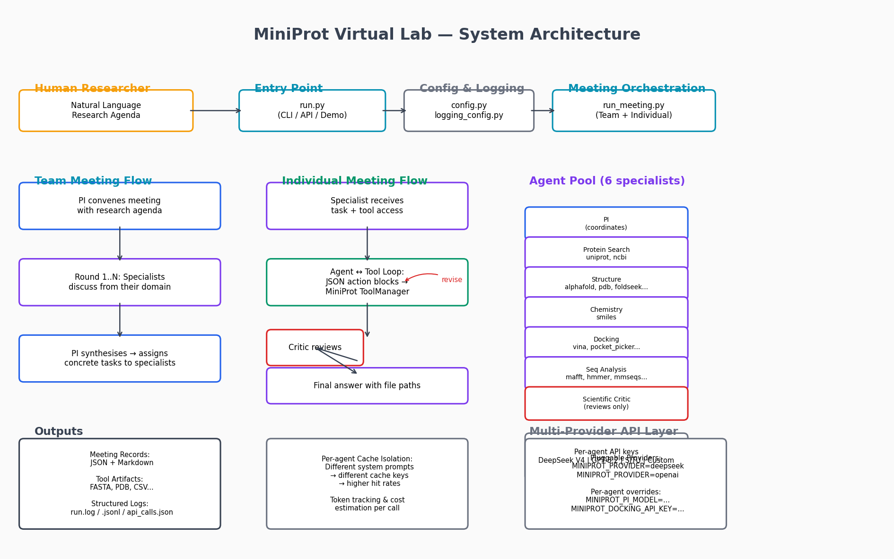
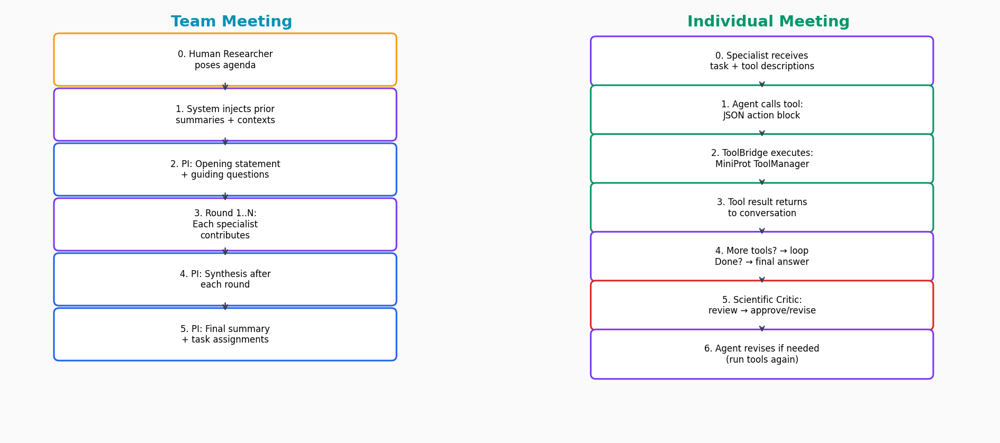
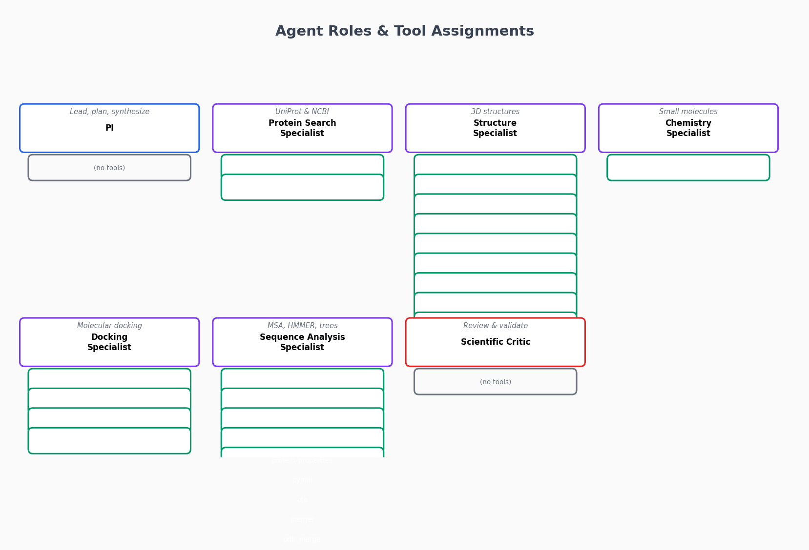

# MiniProt Virtual Lab

[](https://www.python.org/)
[](LICENSE)

**AI-Human collaboration framework for protein & enzyme research.**

> [中文版 (Chinese Version)](README_CN.md)

Combines the **multi-agent meeting architecture** of [Virtual Lab](https://github.com/zou-group/virtual-lab) (Zou Group, *Nature* 2025) with the **bioinformatics tool capabilities** of [MiniProt](https://github.com/SJTU-software-2026/enzyme_update). A human researcher works with a team of specialist LLM agents — each with access to specific protein/enzyme tools — through team meetings and individual work sessions.



---

## 1. Features

| Feature | Description |
|---------|-------------|
| **Multi-Agent Meetings** | Team meetings (PI + 5 specialists) and individual meetings (specialist + tools + critic) |
| **33 Bioinformatics Tools** | UniProt, AlphaFold, AutoDock Vina, HMMER, MAFFT, Foldseek, PyMOL... |
| **YAML Config File** | Single `config/settings.yaml` — every option documented with bilingual comments |
| **Multi-Provider** | DeepSeek V4 (default), OpenAI GPT-5.2, SJTU server, custom endpoints |
| **Per-Agent API Isolation** | Each agent can use a different API key/model for prompt-cache isolation |
| **Structured Logging** | JSONL traces, API call logs, tool execution logs, agent response records |
| **Scientific Critic** | Automatic review of specialist outputs for correctness and completeness |
| **Meeting History** | Load previous meetings as context — agents continue where they left off |
| **Optional Tool Downloads** | Git submodules + setup scripts — choose what you need, core repo ~1 MB |



---

## 2. Quick Start

```bash
git clone https://github.com/SJTU-software-2026/miniprot_virtual_lab.git
cd miniprot_virtual_lab
pip install -r requirements.txt

# 1. Configure
cp config/settings.example.yaml config/settings.yaml
# Edit settings.yaml — add your API key

# 2. Get tool binaries (pick one)
docker-compose build                                     # Docker — everything included
# OR: cp config/tool_paths.example.yaml config/tool_paths.yaml  # Use local tools
# OR: bash scripts/setup_tools.sh                              # Download to tools_src/

# 3. Run
python run.py --demo
python run.py                          # Interactive mode
```

---

## 3. System Architecture

The Virtual Lab organizes research as a series of **meetings**:

```
Human Researcher
      │
      ▼
┌─────────────────────────────────────────┐
│  TEAM MEETING: PI convenes → discuss    │
│  → PI assigns tasks to specialists      │
└─────────────────────────────────────────┘
      │
      ▼ (parallel individual meetings)
┌──────────┐ ┌──────────┐ ┌──────────┐
│ SPECIALIST│ │ SPECIALIST│ │ SPECIALIST│
│ executes  │ │ executes  │ │ executes  │
│ tools     │ │ tools     │ │ tools     │
│     │     │ │     │     │ │     │     │
│  CRITIC   │ │  CRITIC   │ │  CRITIC   │
│  reviews  │ │  reviews  │ │  reviews  │
└──────────┘ └──────────┘ └──────────┘
      │            │            │
      ▼            ▼            ▼
┌─────────────────────────────────────────┐
│  TEAM MEETING: PI reviews → final report│
└─────────────────────────────────────────┘
```



---

## 4. Installation

### 4.1 Prerequisites

- Python 3.10+ (3.12 recommended)
- Git

### 4.2 Clone & install

```bash
git clone https://github.com/SJTU-software-2026/miniprot_virtual_lab.git
cd miniprot_virtual_lab
pip install -r requirements.txt
```

All bioinformatics tool implementations are vendored in `src/miniprot_virtual_lab/vendor/` — no external enzyme_update clone needed.

### 4.3 Configure

```bash
cp config/settings.example.yaml config/settings.yaml
# Edit settings.yaml — fill in your API key(s). Every option is documented.
```

**Configuration priority (highest to lowest):**

| Priority | Source | Example |
|----------|--------|---------|
| 1 | Agent attribute (Python code) | `Agent(..., api_key="sk-...")` |
| 2 | Environment variable | `MINIPROT_DOCKING_SPECIALIST_API_KEY` |
| 3 | YAML `agents.<slug>` | `agents.docking_specialist.api_key` |
| 4 | YAML `global` | `global.api_key` |
| 5 | Provider preset env var | `MINIPROT_PROVIDER` |
| 6 | Global env var | `DEEPSEEK_API_KEY` |
| 7 | Hard-coded default | DeepSeek V4 |

Switch providers: `export MINIPROT_PROVIDER=openai` (deepseek | openai | sjtu | custom).

> If `settings.yaml` is missing, the program falls back to `settings.example.yaml` and prints a prominent warning reminding you to copy and edit it.

### 4.4 Tool binaries — four options

Many tools need external binaries (MAFFT, Vina, P2Rank, etc.). Pick one:

#### A. Submodules + setup script (lightest)

```bash
cd miniprot_virtual_lab                                 # must be inside the repo
git submodule update --init tools_src/omegafold          # optional: OmegaFold
bash scripts/setup_tools.sh                              # Linux/macOS: P2Rank + Java
powershell -File scripts/setup_tools.ps1                 # Windows: P2Rank + Java
```

Core repo ~1 MB. Tools downloaded on demand.

#### B. Docker (all-in-one)

```bash
docker-compose build
docker-compose run --rm miniprot-vlab python run.py --demo
```

25+ tools pre-installed. See [4.5 Docker details](#45-docker-details).

#### C. Local installations

```bash
cp config/tool_paths.example.yaml config/tool_paths.yaml
# Edit tool_paths.yaml — point to your existing binaries
```

#### D. Manual download

Download to the gitignored `tools_src/` directory, then configure `tool_paths.yaml`:

| Tool | Size | Source |
|------|------|--------|
| P2Rank | ~260 MB | https://github.com/rdk/p2rank/releases |
| OmegaFold | ~5 MB (git) | `git submodule update --init` |
| OpenJDK 17 | ~180 MB | https://adoptium.net/download/ |

### 4.5 Docker details

The image bundles 25+ tools (MAFFT, MMseqs2, CD-HIT, Foldseek, TM-align, AutoDock Vina, Open Babel, Meeko, FastTree, PyMOL, P2Rank, Java 17, ETE, ESMFold, OmegaFold...).

```bash
# Build & run
docker-compose build --no-cache
docker-compose run --rm miniprot-vlab python run.py --demo
docker-compose run --rm miniprot-vlab                       # interactive

# With env
DEEPSEEK_API_KEY="sk-..." docker-compose run --rm miniprot-vlab
```

Volumes: `./data`, `./meetings`, `./logs` are persisted on the host. `./config/settings.yaml` is mounted read-only.

### 4.6 Verify

```bash
python run.py --providers     # List AI providers
python run.py --demo          # Run demo pipeline
```

---

## 5. Usage

### 5.1 Interactive mode

```bash
python run.py
```

```
Virtual Lab> /team Design a pipeline to find novel lipases in bacteria
Virtual Lab> /task search Search UniProt for lipase, reviewed only
Virtual Lab> /task structure Get AlphaFold structure for P12345
Virtual Lab> /history             # List saved meetings
Virtual Lab> /load 01_planning    # Load meeting as context
Virtual Lab> /agents              # List agents + API config
Virtual Lab> /demo                # Run demo pipeline
```

### 5.2 CLI mode

```bash
python run.py --agenda "Find insulin proteins and their 3D structures"
python run.py --provider openai --demo
python run.py --context meetings/01_planning.json --agenda "Continue..."
```

### 5.3 Python API

```python
from pathlib import Path
from miniprot_virtual_lab import (
    run_meeting, RunLogger,
    PRINCIPAL_INVESTIGATOR, PROTEIN_SEARCH_SPECIALIST, DEFAULT_TEAM,
)

rl = RunLogger(Path("./logs/experiment_1"))

# Team meeting
summary = run_meeting(
    meeting_type="team",
    agenda="Identify and characterize novel cellulases...",
    team_lead=PRINCIPAL_INVESTIGATOR,
    team_members=DEFAULT_TEAM,
    save_dir=Path("./meetings"),
    num_rounds=3, return_summary=True, run_logger=rl,
)

# Individual meeting with tools
run_meeting(
    meeting_type="individual",
    agenda="Search UniProt for cellulases, download FASTA...",
    team_member=PROTEIN_SEARCH_SPECIALIST,
    save_dir=Path("./meetings"),
    enable_tools=True, run_logger=rl,
)

rl.finalize()
```

---

## 6. Agent Roles

| Agent | Tools | Role |
|-------|-------|------|
| **Principal Investigator (PI)** | — | Lead team, synthesize, assign tasks |
| **Protein Search Specialist** | `uniprot_search`, `ncbi_search` | Find proteins in UniProt/NCBI |
| **Structure Specialist** | `alphafold`, `pdb`, `foldseek`, `tmalign`, `esmfold`, `omegafold`, `structure_from_fasta`, `structure_alignment_batch`, `similarity_matrix` | Get/predict 3D structures |
| **Chemistry Specialist** | `smiles` | Look up compounds, prepare ligands |
| **Docking Specialist** | `autodock_vina`, `pocket_picker`, `pocket_box`, `pdb_repair` | Molecular docking |
| **Sequence Analysis Specialist** | `sequence_alignment`, `hmmer`, `mmseqs2`, `cdhit`, `protein_properties`, `pymol`, `ete`, `merger`, `pdb_merge`, `fasta_convert`, `sequence_length_filter`, `sequence_similarity` | MSA, homolog search, phylogenetics |
| **Scientific Critic** | — | Review outputs for correctness |

See [TOOL_GUIDE.md](src/miniprot_virtual_lab/tools/TOOL_GUIDE.md) for the complete 33-tool reference.

---

## 7. Meeting Types

### 7.1 Team meeting

```
Round 1: PI opens → Specialist 1 → ... → PI synthesizes
Round 2..N: Specialists contribute → PI synthesizes
Final: PI produces summary + task assignments
```

### 7.2 Individual meeting (with tools)

```
Specialist receives task → calls tools (JSON action blocks)
  → Critic reviews → Agent revises (if needed)
```

Tool call format: `{"action": "run_tool", "tool": "uniprot_search", "args": {"query": "insulin", "limit": 5}}`

### 7.3 Continuing from previous meetings

```bash
Virtual Lab> /history                    # List saved meetings
Virtual Lab> /load 01_team_planning      # Load as context
Virtual Lab> /context                    # Show loaded context
Virtual Lab> /team Continue our project  # Agents reference prior discussions
```

```python
from miniprot_virtual_lab import load_meeting_context, run_meeting, PRINCIPAL_INVESTIGATOR, DEFAULT_TEAM
from pathlib import Path

ctx = load_meeting_context("meetings/01_team_planning.json")
run_meeting(
    meeting_type="team",
    agenda="Continue our project with the next steps...",
    team_lead=PRINCIPAL_INVESTIGATOR,
    team_members=DEFAULT_TEAM,
    save_dir=Path("./meetings"),
    summaries=ctx["summaries"],
    contexts=ctx["contexts"],
)
```

---

## 8. Logging

Every run generates structured logs in `logs/run_<timestamp>/`:

| File | Content |
|------|---------|
| `run.log` | Human-readable text log |
| `run.jsonl` | Structured event stream (one JSON per line) |
| `api_calls.json` | All LLM API calls — model, tokens, latency, cost |
| `tools.json` | All tool executions — success/failure, elapsed |
| `discussion.jsonl` | Every agent response — full content, agent, round |

```python
from miniprot_virtual_lab import RunLogger
rl = RunLogger(Path("./logs/experiment"))
rl.log_api_call(agent="Search", model="deepseek-v4-pro", input_tokens=1500, output_tokens=800, latency_ms=3200)
rl.log_tool_call(agent="Search", tool="uniprot_search", args={"query": "insulin"}, success=True, elapsed_ms=450)
rl.finalize()
```

---

## 9. Project Structure

```
miniprot_virtual_lab/
├── run.py                             # Entry point (CLI + demo + API)
├── Dockerfile / docker-compose.yml    # Docker environment
├── requirements.txt
├── README.md / README_CN.md
├── config/
│   ├── settings.example.yaml          # User config template
│   └── tool_paths.example.yaml        # Local tool paths template
├── scripts/
│   ├── draw_architecture.py           # Diagram generator
│   ├── setup_tools.sh                 # Linux/macOS tool downloader
│   └── setup_tools.ps1                # Windows tool downloader
├── tools_src/                         # Optional tool downloads (gitignored)
│   ├── omegafold/                     # Git submodule
│   ├── p2rank/                        # Manual download
│   └── README.md
└── src/miniprot_virtual_lab/
    ├── agent.py                       # Agent dataclass
    ├── config.py                      # Provider + YAML config resolver
    ├── constants.py                   # Tool categories, workflows
    ├── logging_config.py              # Structured logging (RunLogger)
    ├── prompts.py                     # Agent roles, meeting templates
    ├── run_meeting.py                 # Meeting orchestration + context loading
    ├── utils.py                       # Token counting, I/O, cost
    ├── vendor/                        # Vendored enzyme_update tools (33 implementations)
    │   ├── tool_runner.py             # ToolManager registry
    │   ├── tools/                     # All tool .py files
    │   └── utils/                     # path_utils, pdb_clean, fasta_parser
    └── tools/                         # Tool package (8 categories)
        ├── TOOL_GUIDE.md              # 33-tool reference guide
        ├── bridge.py / schemas.py     # ToolBridge + normalization
        ├── tool_paths.py              # Local tool path resolver
        └── {search,structure,chemistry,docking,sequence,visualization,utility,specialized}/
```

Generate architecture diagrams: `python scripts/draw_architecture.py`

---

## License

MIT.

## Citation

Swanson, K., Wu, W., Bulaong, N.L. et al. *The Virtual Lab of AI agents designs new SARS-CoV-2 nanobodies.* Nature (2025). https://doi.org/10.1038/s41586-025-09442-9
